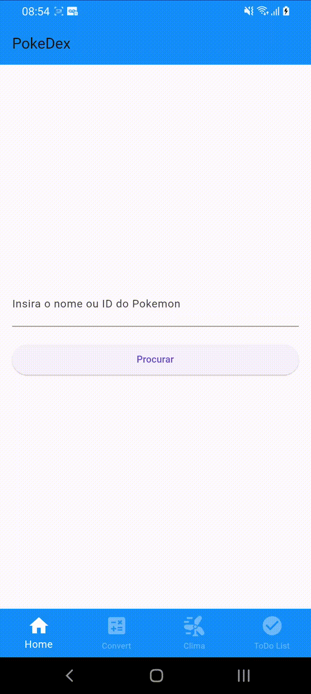
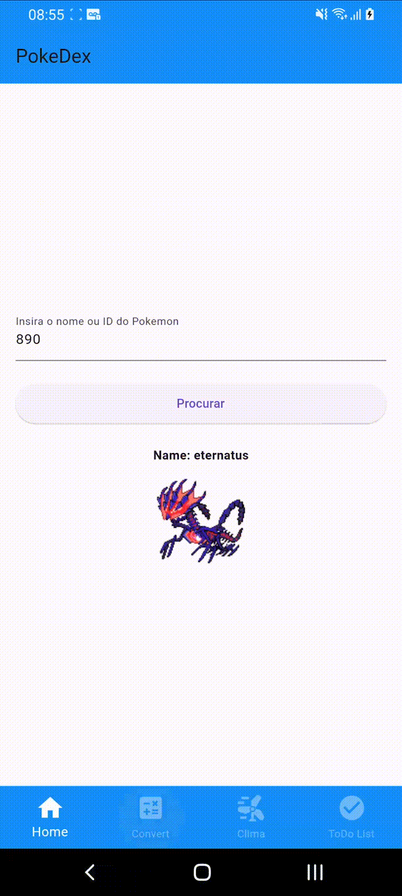
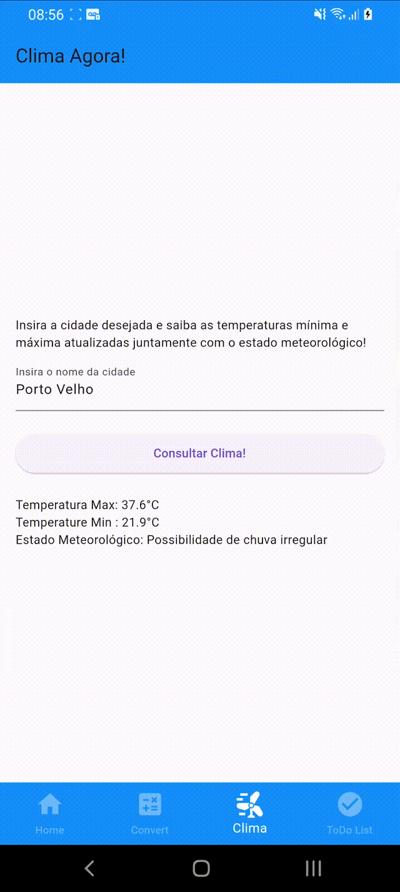

# Teste Prático Flutter - UniSapiens 📱

Este é um projeto de teste prático de conhecimento em Flutter para os alunos da faculdade UniSapiens. O aplicativo contém 4 menus no `bottomNavigationBar`:

## Funcionalidades Principais 🚀
1. **Home:** 🏠 (Página Inicial) - (inclui consumo de API - pokeAPI) *Pronto*
   - Bônus: Consulta de Pokémon por nome ou número ID  
   

2. **Convert:** 💱 (Página de Conversão de Moedas) - (inclui consumo de API - HG Brasil) *Pronto*
   - Consulta do valor da moeda selecionada em Real  
   

3. **Clima:** 🌤️ (Página de Previsão do Tempo) - (inclui consumo de API - WeatherAPI) *Pronto*
   - Consulta do clima do dia atual  
   

4. **ToDo List:** 📝 (Página de Lista de Tarefas) - *Pronto*  
   - Inserção e busca de tarefas utilizando o conceito de pilha  
   

### Descrição das Páginas:
- **Home:** Esta é a página inicial do aplicativo. Permite a consulta de Pokémon por nome ou número ID.
- **Convert:** Permite a consulta do valor da moeda selecionada em Real.
- **Clima:** Aqui permite a consulta das informações climáticas do dia atual com base em uma API externa.
- **ToDo List:** Contém uma lista de tarefas funcional, organizada com o conceito de pilha.

## Status do Projeto 🛠️
- **Home:** Funcional.
- **Convert:** Funcional.
- **Clima:** Funcional.
- **ToDo List:** Completo e funcional.

## Instruções de Uso 📋
- Clone este repositório.
- Abra-o em seu ambiente de desenvolvimento preferido (IDE).
- Execute o aplicativo em um emulador ou dispositivo físico compatível com Flutter.

## Licença 📄
Este projeto está sob a licença MIT.
